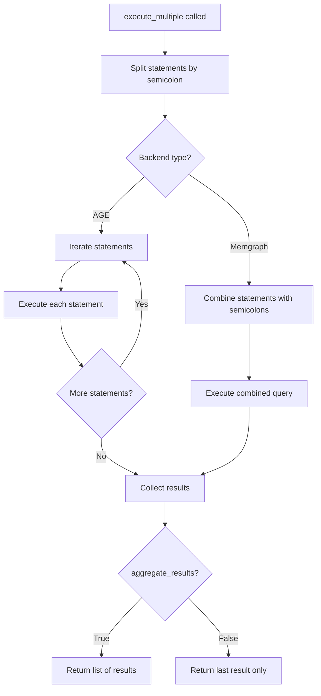

# Multiple Statement Execution Design

**Status:** Analysis/Design - Implementation Not Yet Decided  
**Created:** 2025-10-15  
**Related Issues:** Semicolon handling in Cypher queries  
**Purpose:** Analysis and design documentation for future reference

> **Note:** This document is for analysis purposes only. No decision has been made about whether 
> to implement this feature. It serves as a reference for understanding the problem space, 
> backend capabilities, and potential implementation approaches if/when the feature is needed.

## Overview

This document describes the design for supporting multiple Cypher statements in a single execution call. Currently, the library supports single statements with optional trailing semicolons per the openCypher specification. This proposal extends functionality to handle multiple semicolon-separated statements.

## Background

### Current Implementation

The `execute()` method handles single Cypher statements:

```python
# Single statement without semicolon
db.execute("MATCH (p:Person) RETURN p")

# Single statement with optional trailing semicolon (openCypher standard)
db.execute("MATCH (p:Person) RETURN p;")
```

**Backend-Specific Handling:**

- **Memgraph (Bolt protocol):** Handles semicolons natively, supports multiple statements
- **Apache AGE (SQL wrapper):** Semicolons cause SQL syntax errors in `cypher()` function
  - Current fix: Strip trailing semicolon before embedding into SQL (implemented 2025-10-15)

### OpenCypher Specification

According to the openCypher grammar (`Cypher.g4`):

```antlr
oC_Cypher
      :  SP? oC_Statement ( SP? ';' )? SP? EOF ;
```

Semicolons are **optional** statement terminators for single statements.

### Backend Capabilities

Based on research (Perplexity, 2025-10-15):

| Backend | Multiple Statements | Native Support | Notes |
|---------|---------------------|----------------|-------|
| **Memgraph** | ✅ Yes | Native | Parser interprets `;` as delimiter |
| **Apache AGE** | ❌ No | Manual | Each statement must be executed separately |
| **Neo4j** | ⚠️ Conditional | APOC required | Requires `apoc.cypher.runMany` procedure |

## Problem Statement

Users may want to execute multiple statements in a single call for:

1. **Script execution** - Running initialization or migration scripts
2. **Batch operations** - Multiple CREATE/UPDATE operations
3. **Query sequences** - Related queries that should execute together
4. **Convenience** - Reduced API calls and simplified code

**Example Use Case:**

```python
db.execute_multiple("""
    CREATE (p:Person {name: 'Alice', age: 30});
    CREATE (q:Person {name: 'Bob', age: 25});
    MATCH (p:Person) RETURN count(p);
""")
```

## Requirements

### Functional Requirements

1. **FR-1:** Support executing multiple semicolon-separated Cypher statements
2. **FR-2:** Work consistently across all supported backends (Memgraph, AGE)
3. **FR-3:** Return aggregated results from all statements
4. **FR-4:** Maintain backward compatibility with existing `execute()` method
5. **FR-5:** Provide clear error messages indicating which statement failed
6. **FR-6:** Support mixed statement types (CREATE, MATCH, DELETE, etc.)

### Non-Functional Requirements

1. **NFR-1:** Performance should be optimized per backend capabilities
2. **NFR-2:** API should be intuitive and follow Python conventions
3. **NFR-3:** Error handling must be robust and informative
4. **NFR-4:** Documentation must clearly explain differences from `execute()`

## Proposed Solution

### API Design

#### New Method: `execute_multiple()`

```python
def execute_multiple(
    self,
    cypher_statements: str,
    *,
    aggregate_results: bool = True,
    fail_fast: bool = True,
    **kwargs
) -> list[TabularResult] | TabularResult:
    """Execute multiple semicolon-separated Cypher statements.
    
    Args:
        cypher_statements: String containing multiple statements separated by semicolons
        aggregate_results: If True, return list of all results; if False, return only last result
        fail_fast: If True, stop on first error; if False, continue and collect errors
        **kwargs: Additional parameters passed to individual execute calls
        
    Returns:
        List of TabularResult objects (one per statement) if aggregate_results=True,
        otherwise only the result of the last statement.
        
    Raises:
        MultipleStatementExecutionError: If any statement fails (includes failed statement index)
        
    Example:
        >>> results = db.execute_multiple('''
        ...     CREATE (p:Person {name: 'Alice'});
        ...     CREATE (q:Person {name: 'Bob'});
        ...     MATCH (p:Person) RETURN count(p);
        ... ''')
        >>> len(results)
        3
        >>> results[2]  # Result from MATCH query
        [(2,)]
    """
```

### Implementation Strategy

#### 1. Statement Parsing

```python
def _split_statements(cypher_str: str) -> list[str]:
    """Split multiple statements while preserving string literals.
    
    Handles:
    - String literals containing semicolons: "text;with;semicolons"
    - Escaped characters
    - Multi-line statements
    - Empty statements (consecutive semicolons)
    """
    # Implementation using parser or regex with lookahead
    statements = []
    # Split on semicolons not within quotes
    # Filter out empty statements
    # Strip whitespace
    return statements
```

#### 2. Backend-Specific Execution

##### Memgraph Implementation (Optimized)

```python
def _execute_multiple_memgraph(statements: list[str]) -> list[TabularResult]:
    """Memgraph supports multiple statements natively via Bolt protocol."""
    # Join statements with semicolons and execute as single query
    combined = "; ".join(statements)
    result = self._execute_single(combined)
    # Parse and split results
    return results
```

##### AGE Implementation (Sequential)

```python
def _execute_multiple_age(statements: list[str]) -> list[TabularResult]:
    """AGE requires executing each statement separately."""
    results = []
    for idx, stmt in enumerate(statements):
        try:
            # Strip trailing semicolon for AGE
            clean_stmt = stmt.rstrip(";").strip()
            result = self._execute_single(clean_stmt)
            results.append(result)
        except Exception as e:
            raise MultipleStatementExecutionError(
                f"Statement {idx + 1} failed: {stmt}",
                statement_index=idx,
                failed_statement=stmt,
                original_error=e
            ) from e
    return results
```

#### 3. Error Handling

```python
class MultipleStatementExecutionError(CypherGraphDBError):
    """Raised when a statement in a multi-statement execution fails."""
    
    def __init__(
        self,
        message: str,
        statement_index: int,
        failed_statement: str,
        original_error: Exception
    ):
        super().__init__(message)
        self.statement_index = statement_index
        self.failed_statement = failed_statement
        self.original_error = original_error
```

### Execution Flow



## Implementation Phases

> **Important:** These phases are proposed for analysis purposes only. Implementation is 
> subject to future decision based on user demand, priority, and resource availability.

### Phase 1: Core Functionality (MVP)

- [ ] Implement statement splitting logic
- [ ] Add `execute_multiple()` method to `CypherGraphDB`
- [ ] Implement sequential execution for AGE backend
- [ ] Add basic error handling with statement index
- [ ] Write unit tests for statement parsing
- [ ] Write integration tests for both backends

### Phase 2: Optimization

- [ ] Implement optimized Memgraph execution (single query)
- [ ] Add result caching/buffering for large result sets
- [ ] Performance benchmarking and optimization

### Phase 3: Advanced Features

- [ ] Add `fail_fast` parameter for error handling strategy
- [ ] Support transaction control (BEGIN/COMMIT/ROLLBACK)
- [ ] Add progress callbacks for long-running scripts
- [ ] Support for parameter passing to multiple statements

## Decision Criteria

Before implementing this feature, consider:

1. **User Demand:** Is there demonstrated need from users for this functionality?
2. **Workarounds:** Can users adequately solve this with multiple `execute()` calls?
3. **Complexity:** Does the benefit justify the implementation and maintenance cost?
4. **Backend Support:** Will all target backends support this adequately?
5. **Priority:** Are there higher-priority features or fixes needed first?

## Alternatives Considered

### Alternative 1: Client-Side Splitting

**Approach:** User splits statements manually and calls `execute()` multiple times.

**Pros:**
- No library changes needed
- User has full control

**Cons:**
- Inconvenient for users
- No optimization opportunities
- Inconsistent error handling

**Decision:** Rejected - library should provide convenience methods

### Alternative 2: Batch Execution Only

**Approach:** Only optimize for backends that support it natively (Memgraph).

**Pros:**
- Simpler implementation
- Better performance on supported backends

**Cons:**
- Inconsistent API across backends
- AGE users miss out on functionality

**Decision:** Rejected - consistent API is priority

### Alternative 3: Separate execute_script() Method

**Approach:** Different method name to indicate script execution.

**Pros:**
- Clear semantic difference
- Could have script-specific features

**Cons:**
- API proliferation
- Unclear when to use which method

**Decision:** Under consideration - may be better name than `execute_multiple()`

## Testing Strategy

### Unit Tests

1. Statement splitting with various semicolon placements
2. String literal handling (semicolons in strings)
3. Empty statement filtering
4. Error message formatting

### Integration Tests

1. Multiple CREATE statements on both backends
2. Mixed statement types (CREATE, MATCH, DELETE)
3. Error handling (which statement failed)
4. Large statement counts (performance)
5. Statements with RETURN clauses
6. Statements without RETURN clauses

### Performance Tests

1. Compare single combined query vs. sequential (Memgraph)
2. Measure overhead of splitting logic
3. Large script execution (100+ statements)

## Documentation Requirements

### User Documentation

1. **Usage Guide:** When to use `execute()` vs `execute_multiple()`
2. **Examples:** Common use cases with code samples
3. **Limitations:** Backend-specific behavior differences
4. **Migration Guide:** How to update existing scripts

### Developer Documentation

1. **Architecture:** How statement splitting works
2. **Backend Implementation:** How each backend handles multiple statements
3. **Error Handling:** Exception hierarchy and handling strategy

## Security Considerations

1. **SQL Injection:** Ensure statement splitting doesn't introduce vulnerabilities
2. **Resource Limits:** Prevent DOS via extremely long statement lists
3. **Transaction Safety:** Document atomicity guarantees (or lack thereof)

## Performance Considerations

### Memgraph Optimization

- **Single Query:** Combine statements and send as one Bolt protocol message
- **Expected Speedup:** Significant (eliminate network round-trips)

### AGE Sequential Execution

- **Current Approach:** One SQL query per statement
- **Limitation:** Inherent to AGE's `cypher()` function design
- **Mitigation:** Connection pooling, prepared statements

## Open Questions

1. Should we support prepared statements with multiple executions?
2. How to handle different result types from different statements?
3. Should we support transaction control (BEGIN/COMMIT)?
4. What's the maximum recommended number of statements?
5. Should we add a streaming/iterator interface for large scripts?

## References

- [OpenCypher Grammar Specification](https://github.com/opencypher/openCypher/blob/master/grammar/Cypher.g4)
- [Neo4j APOC Documentation - runMany](https://neo4j.com/docs/apoc/current/cypher-execution/cypher-multiple-statements/)
- [Memgraph Cypher Documentation](https://memgraph.com/docs/cypher-manual)
- [Apache AGE Documentation](https://age.apache.org/age-manual/master/intro/overview.html)
- Perplexity Research: Multiple statement handling (2025-10-15)

## Revision History

| Date | Version | Author | Changes |
|------|---------|--------|---------|
| 2025-10-15 | 0.1 | Initial | Design proposal created for analysis purposes - implementation not yet decided |

---

**Document Status:** This is an analysis and design document only. No commitment to implement this feature 
has been made. It exists to document the problem space, research findings, and potential approaches should 
the feature be prioritized in the future.
